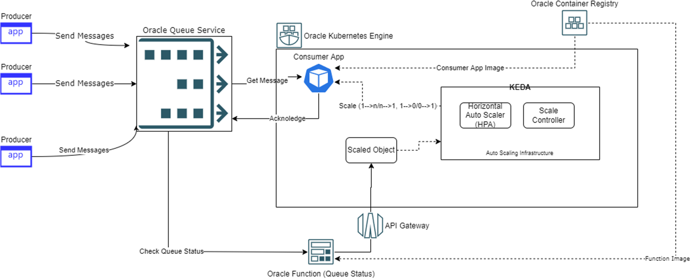

# oci-arch-queue-oke-demo

 

## Introduction
This repository contains the code and instructions to create and run an OCI Queue demo that runs a consumer that can autoscale on Oracle Kubernetes Engine (OKE), a demo producer that you can run anywhere(Local Desktop/Virtual Machine), and an OCI Function that provides queue depth for the autoscaling of queue consumers with KEDA.

An overview video and demo video is available [here](https://youtu.be/4RMA_EMjyfo) and [here](https://www.youtube.com/watch?v=wC3h9LmKgGY).

This document walks through the build and deployment necessary to configure the demo. Each part of the demo has a readme file explaining how to build and deploy the components in the demo. Which can be found at:

- [Producer](./local-producer/readme.md)
- [Queue Depth function](./queue-length-function/readme_function.md)
- [Consumer](./oke-consumer/readme_consumer.md)

Please follow the steps provided in this document, as well as the readme of individual components, so that you can run this demo in your tenancy.
The core of this document focuses on creating the environment and then running the demo.

## Getting Started

 We will add our components using OCI Console.  While working within the OCI Console, we will retrieve a number of details that will need to be added to the configuration of the different resources.  Such as the Queue OCID.

### Prerequisites

- OCI Cloud account
- OCI Compartment with privileges to manage:
  - OCI Queue
  - Kubernetes Engine
  - Network
  - API gateway
  - Container Registry
  - VCN    

### Build

##### Foundation

1. Within OCI we need to have a compartment to work with. The guidance for creating a compartment can be found [here](https://docs.oracle.com/en/cloud/paas/integration-cloud/oracle-integration-oci/creating-oci-compartment.html).
2. Get the user token, fingerprint, and related attributes needed by the OCI API to enable the application to communicate using the SDK. The details on how to do this can be found [here](https://docs.oracle.com/en-us/iaas/Content/API/Concepts/apisigningkey.htm). You may wish to use different users for the provider and consumer utilities. This is needed only if you are using User principal and running it locally. If you are using OCI services (Instance/Function/OKE) then you don't need to generate all of it. We are going to use instances principal and resource principal while running our code base with OCI-managed services.
3. We can shortcut setting up Kubernetes (OKE) and the worker nodes using the one-click deploy button provided as part of a prebuilt Terraform library called [terraform-oci-arch-microservice-oke](https://github.com/oracle-devrel/terraform-oci-arch-microservice-oke).
4. Lastly, we will need a OCI API Gateway deployment within our compartment. The details for creating this are available [here](https://docs.oracle.com/en-us/iaas/Content/APIGateway/Tasks/apigatewayquickstartsetupcreatedeploy.htm).

##### Creating the Queue

1. Within the compartment, we need to create the queue and ensure that the applications know about it through its OCID. The steps for creating a queue can be followed in the OCI Queue documentation.<a href="https://docs.oracle.com/en-us/iaas/Content/queue/queue-create.htm" target="_blank">Creating OCI Queue</a>

2. With the queue established, you may wish to try using the OCI Console's Queue UI to send and receive. The steps to do this can be found in the OCI Queue UI documentation.
3. The OCID for the Queue needs to be made available to our applications before they are deployed. Each of the subsidiary readme documents has a section called *setting the queue OCID,* which details how to set the Queue OCID.

##### Deployment

With the infrastructure ready, the different components can be deployed and executed. Each of the component readme documents will describe the configuration and deployment steps. Each of the component *readme.md* also talks about setting up components.

##### Execution

With the services deployed and configured along with our [Consumer](./oke-consumer/readme.md) and [Queue Depth function](./queue-length-function/readme.md). Execution is simply a case of running one of the scripts provided by the [Producer](./local-producer/readme.md).

#### Observing queue production and consumption

As observing how the different elements execute is unique to that element, the readme documentation for those elements describes how you can see them work.

## Notes/Issues

None

## URLs
* These will be unique to the deployment

## Contributing
This project is open source.  Please submit your contributions by forking this repository and submitting a pull request!  Oracle appreciates any contributions that are made by the open-source community.

## License
Copyright (c) 2022 Oracle and/or its affiliates.

Licensed under the Universal Permissive License (UPL), Version 1.0.

See [LICENSE](LICENSE) for more details.

ORACLE AND ITS AFFILIATES DO NOT PROVIDE ANY WARRANTY WHATSOEVER, EXPRESS OR IMPLIED, FOR ANY SOFTWARE, MATERIAL OR CONTENT OF ANY KIND CONTAINED OR PRODUCED WITHIN THIS REPOSITORY, AND IN PARTICULAR SPECIFICALLY DISCLAIM ANY AND ALL IMPLIED WARRANTIES OF TITLE, NON-INFRINGEMENT, MERCHANTABILITY, AND FITNESS FOR A PARTICULAR PURPOSE.  FURTHERMORE, ORACLE AND ITS AFFILIATES DO NOT REPRESENT THAT ANY CUSTOMARY SECURITY REVIEW HAS BEEN PERFORMED WITH RESPECT TO ANY SOFTWARE, MATERIAL OR CONTENT CONTAINED OR PRODUCED WITHIN THIS REPOSITORY. IN ADDITION, AND WITHOUT LIMITING THE FOREGOING, THIRD PARTIES MAY HAVE POSTED SOFTWARE, MATERIAL OR CONTENT TO THIS REPOSITORY WITHOUT ANY REVIEW. USE AT YOUR OWN RISK. 
