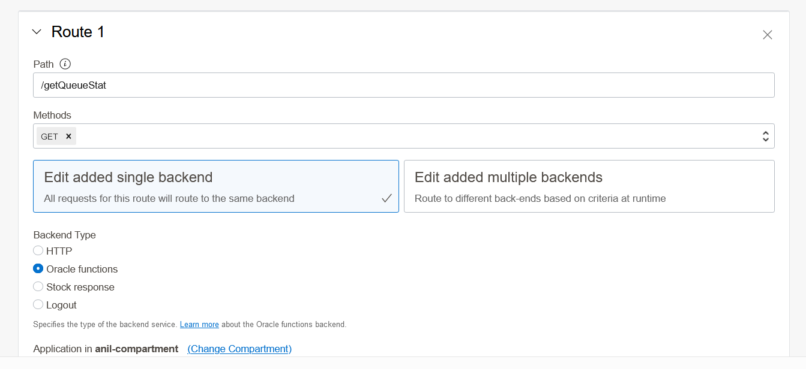

# oci-arch-queue-oke-demo (queue length Function)

[](https://img.shields.io/badge/license-UPL-green) [](https://sonarcloud.io/dashboard?id=oracle-devrel_oci-arch-queue-oke-demo)

## Introduction

The following document describes creating and deploying the serverless Function that reports the queue depth. [KEDA](https://keda.sh/) then utilizes this to control the auto-scaling.

## Getting Started

To deploy this function, please ensure you are setting up the application , vcn, etc. Please check the getting  started guide for function here [Getting Started with Functions](https://docs.oracle.com/en-us/iaas/developer-tutorials/tutorials/functions/func-setup-cs/01-summary.htm)

### Prerequisites

- [Java JDK 8 or later](https://www.oracle.com/java/technologies/downloads/)
- [Oracle OCI SDK](https://docs.oracle.com/en-us/iaas/Content/API/SDKDocs/javasdk.htm)
- [Maven](https://maven.apache.org/download.cgi)
- [OCI CLI](https://docs.oracle.com/en-us/iaas/Content/API/Concepts/cliconcepts.htm)
- [FN Development environment](https://docs.oracle.com/en-us/iaas/Content/Functions/Tasks/functionsconfiguringclient.htm) (includes Docker, Fn tools, etc.)  with [quickstart guide](https://docs.oracle.com/en-us/iaas/Content/Functions/Tasks/functionsquickstartlocalhost.htm).


#### Building the Function

This is a java function, so you can run the Maven command to build it .

`mvn clean package`

### Dynamic Group and Policies


We are going to use resource principle so we have to create a dynamic group , e.g. dyanmic group name is *queue_dg*

`ALL {resource.type = 'fnfunc', resource.compartment.id = '<function/application compartment id>'}`

please use the following policy so that function can invoke queue APIs 

`allow dynamic-group queue_dg to use queues in compartment <queue_parent_compartment>`


### <u>Packaging and deploying the consumer</u>

#### Deploying the Function

To deploy the function, please execute the following command:

`fn -v deploy --app \<your application name\>`

#### Making the queue identifiable and accessible

As the Function runs within the OCI environment, we don't need to provide authentication details. However, the data plane URL is still required along with the OCID of the queue. The function code takes these two values from environment variables called:

- DP_ENDPOINT
- QUEUE_ID

These values can be set once the Function is deployed with the following command:

```
fn config function <app-name> <function-name> DP_ENDPOINT <Your data plane URL for the Queue>
fn config function <app-name> <function-name> QUEUE_ID <Your Queue's OCID>
```
Or you can use OCI console as well to add/update environment variables.
You can read more about this in the Functions documentation about [configuring functions](https://docs.oracle.com/en-us/iaas/Content/Functions/Tasks/functionspassingconfigparams.htm).


#### Exposing the function via the API Gateway

The function is exposed using the API gateway we created, please use the following link to expose it using API gateway [Expose Function using API Gateway](https://docs.oracle.com/en-us/iaas/Content/APIGateway/Tasks/apigatewayusingfunctionsbackend.htm)

An example deployment with a route will look like this:



Once you are done with the API gateway setup, please use this URL to update the consumer *so-object.yaml* file so that it can get queue depth and scale accordingly.
## Notes/Issues

None

## URLs

* These will be unique to the deployment, 
* Note the URL of the API gateway for function has to be updated in *so-object.yaml * file of the *oke-consumer* folder .

## Contributing

This project is open source.  Please submit your contributions by forking this repository and submitting a pull request!  Oracle appreciates any contributions that are made by the open-source community.

## License

Copyright (c) 2022 Oracle and/or its affiliates.

Licensed under the Universal Permissive License (UPL), Version 1.0.

See [LICENSE](LICENSE) for more details.

ORACLE AND ITS AFFILIATES DO NOT PROVIDE ANY WARRANTY WHATSOEVER, EXPRESS OR IMPLIED, FOR ANY SOFTWARE, MATERIAL OR CONTENT OF ANY KIND CONTAINED OR PRODUCED WITHIN THIS REPOSITORY, AND IN PARTICULAR SPECIFICALLY DISCLAIM ANY AND ALL IMPLIED WARRANTIES OF TITLE, NON-INFRINGEMENT, MERCHANTABILITY, AND FITNESS FOR A PARTICULAR PURPOSE.  FURTHERMORE, ORACLE AND ITS AFFILIATES DO NOT REPRESENT THAT ANY CUSTOMARY SECURITY REVIEW HAS BEEN PERFORMED WITH RESPECT TO ANY SOFTWARE, MATERIAL OR CONTENT CONTAINED OR PRODUCED WITHIN THIS REPOSITORY. IN ADDITION, AND WITHOUT LIMITING THE FOREGOING, THIRD PARTIES MAY HAVE POSTED SOFTWARE, MATERIAL OR CONTENT TO THIS REPOSITORY WITHOUT ANY REVIEW. USE AT YOUR OWN RISK. 
